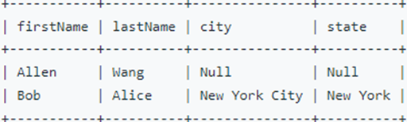

<h1 align="center">Тестовое задание (MS SQL: серия заданий, касается работы с базой данных посредством запросов).</h1>

## Задание №1 

**Дано (структура):**

Таблица *World*
 


Данные


 
**Найти:**

Страна большая, если: его площадь (area) составляет не менее трех миллионов (т.е. 3000000 км2), или его население (population) составляет не менее двадцати пяти миллионов человек (т. е. 25000000 человек).

Напишите запрос SQL, чтобы сообщить название, население и площадь больших стран.

**Результат запроса должен выводить следующие данные:**
 


```SQL
SELECT
    name,
	population,
	area
FROM
    World
WHERE
    area >= 3000000 OR
	population >= 25000000
```

---

## Задание №2 

**Дано (структура):**

Таблица *Products*


*product_id* — первичный ключ для этой таблицы.<br>
*low_fats* — это ENUM типа («***Y***», «***N***»), где «***Y***» означает, что этот продукт с низким содержанием жира, а «***N***» означает, что это не так.<br>
*recyclable* — это ENUM типов («***Y***», «***N***»), где «***Y***» означает, что этот продукт подлежит вторичной переработке, а «***N***» — нет.<br>

Данные


 
**Найти:**

Напишите запрос SQL, чтобы найти идентификаторы продуктов с низким содержанием жира и пригодных для вторичной переработки. Возвратите таблицу результатов в любом порядке. 

**Результат запроса должен выводить следующие данные:**
 


```SQL
SELECT
    product_id
FROM
    Products
WHERE 
	low_fats = 'Y' AND recyclable = 'Y';
```

---

## Задание №3 

**Дано (структура):**

Таблица Person (Эта таблица содержит информацию об идентификаторах некоторых лиц, а также их именах и фамилиях.)


 
*personId* — столбец первичного ключа для этой таблицы. И внешний ключ для таблицы Address.


Таблица Address (Каждая строка этой таблицы содержит информацию о городе и штате одного человека с ID = PersonId.)
 


Данные


 
**Найти:**
Напишите запрос SQL, чтобы сообщить имя, фамилию, город и состояние каждого человека в таблице Person. Если адрес personId отсутствует в таблице Address, вместо этого сообщите значение null. Возвратите таблицу результатов в любом порядке.

**Результат запроса должен выводить следующие данные:**
 


```SQL
SELECT 
    p.firstName,
    p.lastName,
    a.city,
    a.state
FROM 
    Person p
LEFT JOIN 
    Address a ON p.personId = a.personId;
```

---

## Задание №4 

**Дано (структура):**

Таблица *Tree* (Каждая строка этой таблицы содержит информацию об идентификаторе узла и идентификаторе его родительского узла в дереве. Данная структура всегда является допустимым деревом.)
 


Данные


Каждый узел в дереве может быть одного из трех типов:
+ «***Leaf***»: если узел является листовым узлом.
+ «***Root***»: если узел является корнем дерева.
+ «***Inner***»: если узел не является ни конечным узлом, ни корневым узлом.
 
 
**Найти:**

Напишите запрос SQL, чтобы сообщить тип каждого узла в дереве. Возвращает таблицу результатов, упорядоченную по идентификатору в порядке возрастания.

**Результат запроса должен выводить следующие данные:**
 


```SQL
SELECT
    t.id,
    CASE 
        WHEN t.p_id IS NULL THEN 'Root'
        WHEN t.id NOT IN (SELECT p_id FROM Tree WHERE p_id IS NOT NULL) THEN 'Leaf'
        ELSE 'Inner'
    END AS NodeType
FROM 
    Tree t
ORDER BY 
    t.id;
```
